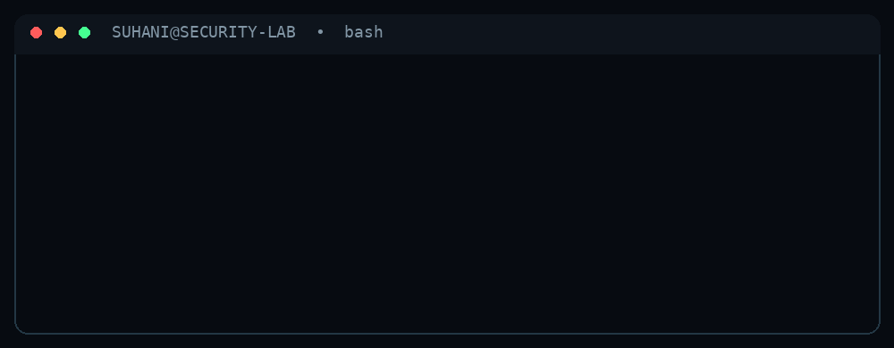

<div align="center">

# `Suhani Munjal`

[](https://git.io/typing-svg)

**Cybersecurity • Digital Forensics • Security Research**

[LinkedIn](https://www.linkedin.com/in/suhani-munjal/) • [GitHub](https://github.com/Suhanimunjal) • [Email](mailto:suhanimunjal97@gmail.com)

</div>

---

<div align="center">

</div>

---

## `01 / OFFENSIVE SECURITY`

**VAPT • Web Security • API Security • CTFs**

```text
┌──────────────────────────────────────────────────────────────┐
│  ATTACK SURFACE                                             │
│                                                              │
│  Web Applications     ████████████████████  ACTIVE          │
│  API Security         ████████████████████  ACTIVE          │
│  Vulnerability Assmt. ████████████████████  ACTIVE          │
│  Attack Simulation    ███████████████████░  ACTIVE          │
│  CTF / Lab Research   ████████████████████  ACTIVE          │
└──────────────────────────────────────────────────────────────┘
```

---

## `02 / DIGITAL FORENSICS`

**Disk Analysis • Drone Forensics • Evidence • Investigation**

```text
[+] disk artifacts        .......... ANALYZING
[+] deleted data          .......... RECOVERING
[+] forensic evidence     .......... PRESERVING
[+] telemetry / logs      .......... EXAMINING
[+] suspicious regions    .......... FLAGGING
```

---

## `03 / SECURITY LAB`

<div align="center">

| Project | Focus |
|:--|:--|
| ⚡ **Shield** | API abuse detection & security monitoring |
| 🔎 **AFDF** | Anti-forensic detection & disk-image analysis |
| ⚛️ **Quantum Project** | Quantum digital signatures & threat detection |
| 🧪 **Security Labs** | VAPT, exploit research & CTF work |

</div>

---

## `04 / LIVE GITHUB ACTIVITY`

<div align="center">


<br/>


</div>

---

## `05 / CONTRIBUTION MATRIX`

<div align="center">

<picture>
  <source media="(prefers-color-scheme: dark)" srcset="https://raw.githubusercontent.com/Suhanimunjal/Suhanimunjal/output/github-contribution-grid-snake-dark.svg">
  <source media="(prefers-color-scheme: light)" srcset="https://raw.githubusercontent.com/Suhanimunjal/Suhanimunjal/output/github-contribution-grid-snake.svg">
  
</picture>

</div>

---

<div align="center">

```text
┌────────────────────────────────────────────────────────┐
│                                                        │
│   > status: ONLINE                                    │
│   > curiosity: HIGH                                   │
│   > attack_surface: EXPLORING                         │
│   > next_target: UNKNOWN                              │
│                                                        │
│   keep learning. keep building. keep breaking.        │
│                                                        │
└────────────────────────────────────────────────────────┘
```

</div>
